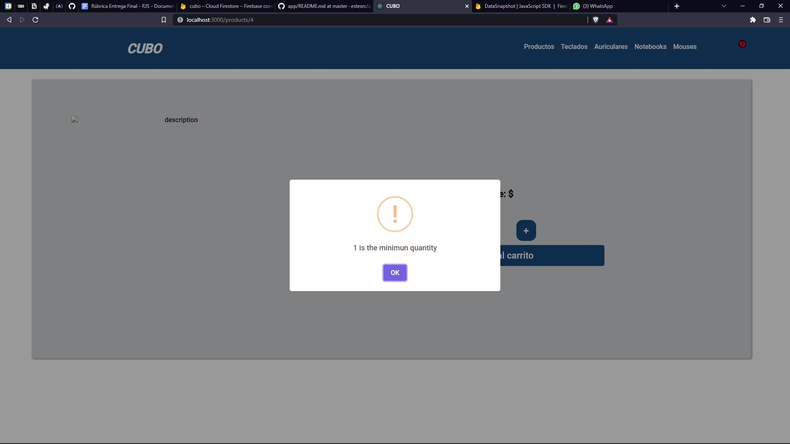

# CUBO - ReactJS

CUBO es una tienda online desarrollada en ReactJs y creada como proyecto final del curso de CoderHouse.


```sh
Si el usuario quisiera dejar el contador el 0 la siguiente alerta aparece inmediatamente.
```




## HERRAMIENTAS
- `React Js`
- `React Router DOM` 
- `CSS 3` 
- `Sweet Alert 2` 
- `Firebase` 

## CARACTERÍSTICAS GENERALES

- Se consume una base de datos alojada en Firebase
- La comunicación con el usuario se lleva a cabo a través de mensajes estilados con Sweet Alert 2.
- Se utiliza un componente counter para gestionar las cantidades de productos que se agregarán al carro.
- El stock de productos es chequeado previo a la compra y por el momento no se actualiza en tiempo real.
- Al finalizar la compra se genera un nro de orden el cual carga en la base de datos la información de la compra y notifica al cliente mediante alerta.
